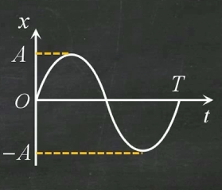

# 大学物理

## 简谐运动

**振动方程：**

$$
x=A\cos(\omega t+\varphi_0)
$$

振幅： $A=\sqrt{x_0^2+\frac{v_0^2}{\omega^2}}$

角频率： $\omega=\sqrt{\frac{k}{m}}=\frac{2\pi}{T}$

初相： $\varphi_0$                                                    相位： $\omega t+\varphi_0$

周期： $T=\frac{2\pi}{\omega}$                                           频率： $v=\frac{1}{T}=\frac{\omega}{2\pi}$

单摆： $T=2\pi\sqrt{\frac{l}{g}}，k=\frac{mg}{l}$

速度： $v=\frac{dx}{dt}=-A\omega\sin(\omega t+\varphi_0)，v_{\max}=A\omega$

加速度： $a=\frac{dv}{dt}=-A\omega^2\cos(\omega t+\varphi_0)=-\omega^2x，a_{\max}=A\omega^2$

力： $F=-kx$

<aside>
💡

$x_0$ ：初位移， $v_0$ ：初速度

$k$ ：弹簧倔强系数， $m$ ：质点质量

弹簧串联： $\frac{1}{k}=\frac{1}{k_1}+\frac{1}{k_2}$ ，弹簧并联： $k=k_1+k_2$

$l$ ：绳长， $g$ ：重力加速度

</aside>

### 振动能量

机械能=动能+势能： $E=\frac{1}{2}mv^2+\frac{1}{2}kx^2=\frac{1}{2}kA^2$

### 简谐振动合成

- 同频率同方向：
    
    $$
    \begin{align*}&x_1=A_1\cos(\omega t+\varphi_1)，x_2=A_a\cos(\omega t+\varphi_2)\\&x=x_1+x_2=A\cos(\omega t+\varphi)\\&\left\{\begin{matrix}A=\sqrt{A_1^2+A_2^2+2A_1A_2\cos(\varphi_2-\varphi_1)}
     \\\tan\varphi=\frac{A_1\sin\varphi_1+A_2\sin\varphi_2}{A_1\cos\varphi_1+A_2\cos\varphi_2}
    
    \end{matrix}\right.\end{align*}
    $$
    

通过在旋转矢量法的圆上进行矢量相加得到合成振动的振幅和相位

- 同向不同频：
    
    $$
    x_1=A\cos(\omega_1t+\varphi),x_2=A\cos(\omega_2t+\varphi) \\ x=x_1+x_2=2A\cos\frac{\omega_2-\omega_1}{2}t\cos(\frac{\omega_2+\omega_1}{2}t+\varphi)
    $$
    
    合振幅随时间变化，形成拍，拍频为 $v=v_2-v_1$
    
    合振动的频率为 $v=(v_1+v_2)/2$
    

## 机械波

**波动方程：**

$$
y=A\cos[\omega(t-\frac{x}{u})+\varphi_0]\\y=A\cos[2\pi(vt-\frac{x}{\lambda})+\varphi_0]\\y=A\cos[\omega t+\varphi_0-\frac{2\pi}{\lambda}x]
$$

波速： $u=\frac{\lambda}{T}=\lambda v$        波长： $\lambda$        频率： $v=\frac{1}{T}$

两点间相位差： $\Delta\varphi=\frac{2\pi}{\lambda}\Delta x$

### 波的干涉

相干条件：振动方向相同，振动方式相同，相位差恒定

$$
 
\Delta\varphi=\varphi_2-\varphi_1-\frac{2\pi(r_2-r_1)}{\lambda}\left\{\begin{matrix}\pm2k\pi & A=A_1+A_2
 \\\pm(2k+1)\pi & A=|A_1-A_2|
\end{matrix}\right.
$$

### 驻波

入射波和反射波叠加成的波

$$
y_1=A\cos2\pi(vt-\frac{x}{\lambda})， y_2=A\cos2\pi(vt+\frac{x}{\lambda})\\y=y_1+y_2=2A\cos2\pi\frac{x}{\lambda}\cos2\pi vt
$$

波节：位置不变，不会上下振动

波腹：振动最大的位置

### 多普勒效应

$$
v=(1-\frac{u_0}{u})v_0
$$

$u_0$：相对速度， $u$：波速， $v_0$：原始频率

## 几何光学

$$
n_{21}=\frac{\sin i}{\sin r}=\frac{v_1}{v_2}=\frac{n_2}{n_1} 
$$

绝对折射率： $n=\frac{c}{v}$ ， $v$：介质内光速

介质内波长： $\lambda_n=\frac{\lambda}{n}$

全反射： $\sin i_c=\frac{n_2}{n_1}$ ， $n_1>n_2$

### 平面反射

物距：p，像距：p’

### 平面折射

$$
S'N=\frac{n_2}{n_1}SN
$$

$S'N$ 称为 $S$ 的视深

### 球面反射

镜顶：O，主光轴：OP

物象关系式：

$$
\frac{1}{p}+\frac{1}{p'}=\frac{2}{R}
$$

<aside>
💡

推导过程：通过 $\alpha\approx\tan\alpha$ 等角度估算得到

</aside>

焦点与焦距：物距为无穷远时（平行光）产生的像点称为焦点，焦点到顶点的距离称为焦距。

焦距： $f=\frac{R}{2}$

物象关系式也可表示为： $\frac{1}{p}+\frac{1}{p'}=\frac{1}{f}$

$p$ ：**实正虚负**，实像为正，虚像为负

$R,f$ ：凹面镜为正，凸面镜为负

横向放大率： $m=\frac{y'}{y}=-\frac{p'}{p}$ ，m大于0为正立像，反之为倒立像

### 球面折射

$$
\frac{n_1}{p}+\frac{n_2}{p'}=\frac{n_2-n_1}{R}
$$

横向放大倍率： $m=\frac{y'}{y}=-\frac{n_1p'}{n_2p}$

$R$ ：凹面镜为负，凸面镜为正，与反射相反

### 薄透镜成像

物象公式：

$$
\frac{1}{p}+\frac{1}{p'}=\frac{n_2-n_1}{n_1}(\frac{1}{R_1}-\frac{1}{R_2})=\frac{1}{f}
$$

$R_1$ ：左半球面镜半径， $R_2$ ：右半球面镜半径， $f$ ：焦距（凸正凹负）

横向放大率： $m=-\frac{p'}{p}$

光焦度： $\phi=\frac{n_1}{f}$ 单位：D

t 忽略不计

## 波动光学

获得**相干光**的两种方法：分波阵面法、分振幅法

光程： $nr$    折射率 $\times$ 几何路径

光程差： $\delta=n_2r_2-n_1r_1$

相位差： $\Delta\varphi=\frac{2\pi}{\lambda}\delta$

### 杨氏双缝干涉

光程差（近似）： $\delta=r_2-r_1=\frac{xd}{D}$

明纹（ $\frac{\lambda}{2}$ 的偶数倍）： $\delta=\pm k\lambda=2k\frac{\lambda}{2}$

暗纹（ $\frac{\lambda}{2}$ 的奇数倍）： $\delta=(2k+1)\frac{\lambda}{2}$             所有的干涉明暗纹光程差相同

条纹间距： $\Delta x=\frac{D\lambda}{d}$

可见明条纹最大级数： $k_{\max}=\frac{d}{\lambda}$

## 薄膜干涉

### 等倾干涉

光程差： $\delta=2nd\cos \gamma+\frac{\lambda}{2}$  **注意：当上下表面都存在半波损失时不加** $\frac{\lambda}{2}$

垂直入射光程差： $\delta=2nd+\frac{\lambda}{2}$

半波损失：光疏射向光密的反射存在半波损失，光密射向光疏无

### 劈尖干涉

光程差： $\delta=2nd+\frac{\lambda}{2}$

条纹高度差： $\Delta h=\frac{\lambda}{2n}$

条纹间距： $l\sin\theta=\frac{\lambda}{2n}$

## 牛顿环

光程差： $\delta=2nd+\frac{\lambda}{2}$

明纹半径： $r=\sqrt{\frac{(2k-1)R\lambda}{2n}}$

暗纹半径： $r=\sqrt{\frac{kR\lambda}{n}}$

## 迈克尔逊干涉仪

$\Delta d=\Delta N\frac{\lambda}{2}$

$\Delta d：移动距离，\Delta N：条纹移动数$

## 单缝衍射

光程差： $\delta=a\sin\theta$

暗纹（ $\frac{\lambda}{2}$ 的偶数倍）： $\delta=\pm k\lambda=2k\frac{\lambda}{2}$    **与之前的相反**

明纹（ $\frac{\lambda}{2}$ 的奇数倍）： $\delta=(2k+1)\frac{\lambda}{2}$  

中央明纹宽： $\Delta x_0=2\frac{f\lambda}{a}$

次级明纹宽： $\Delta x=\frac{f\lambda}{a}$

明纹中心位置： $x=\pm\frac{2k+1}{2}\frac{f\lambda}{a}$

暗纹中心位置： $x=\pm k\frac{f\lambda}{a}$

半角宽度： $a\sin\theta=\lambda，\theta\approx\sin\theta=\frac{\lambda}{a}$ ， 第一级暗纹处对应的衍射角

## 光栅衍射

光栅方程： $(a+b)\sin\theta=\pm k\lambda$        明纹（k=0,1,2,..)

光栅常数： $d=a+b$

主级大最大级数： $k=\frac{a+b}{\lambda}$

缺级： $k=\frac{a+b}{a}k'（k'=\pm1,\pm2,...）$    缺级的整数倍技术不可见（k，2k，3k…）

## 马吕斯定律

## 布儒斯特定律

反射光为线偏振光（完全偏振）

折射光为部分偏振

反射光与折射光垂直

$\tan i_B=\frac{n_2}{n_1}$

