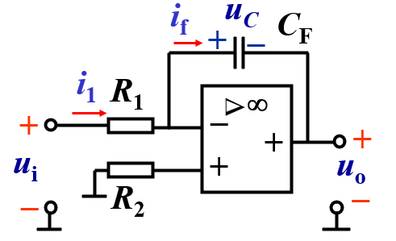

# 电工学

# 集成放大电路

## 理想放大器

**虚断： $i_-=i_+=0$**

**虚短： $u_+=u_-$ （输出端与输入端相连时）**

开环电压放大倍数： $A_{uo}\to\infty$

差模输入电阻： $r_{id}\to\infty$

开环输出电阻： $r_o\to0$

共模抑制比： $k_{CMRR}\to \infty$

## 积分运算电路

$i_1=i_f \\ i_1=\frac{u_i}{R_1}，i_F=C_F\frac{du_c}{dt}$

电容有初始电压： $u_C(t_0)=u_o(t_0)$

$$
u_o=-\frac{1}{R_1C_F}\int u_idt+u_o(t_0)
$$

一个例子

### 比例-积分运算电路 PI调节器

相当于比例电路和积分电路的叠加

$$
u_o=-(R_fi_f+u_C)=-(\frac{R_F}{R_1}u_i+\frac{1}{R_1C_F}\int u_idt)
$$

## 微分运算电路

$i_1=i_f，C_1\frac{u_i}{dt}=-\frac{u_o}{R_F}$

$$
u_o=-R_FC_1\frac{du_i}{dt}
$$

### 比例-微分运算电路 PD调节器

$$
u_o=-(\frac{u_i}{R_1}+C_1\frac{du_i}{dt})
$$

## 滞回比较器

当 $u_0=+U_z$ 时： $u_+=U_+'=\frac{R_2}{R_2+R_F}U_z$ ：**上门限电压**

当 $u_0=-U_z$ 时： $u_+=U_+''=-\frac{R_2}{R_2+R_F}U_z$ ：**下门限电压**

于是当 $u_i>U_+'$ 时， $u_+$ 跃变到 $U_+''$ ；当 $u_i<U_+''$ 时， $u_+$ 跃变到 $U_+'$

出现如下波形：

提高抗干扰能力

使用放大器应注意的问题：选用元件、消振、调零、保护、扩大输出电流

# 反馈电路

**负反馈**：净输入量减小，输出信号减小

**正反馈**：净输入量增大，输出信号增大

**开环放大倍数**： $A=\frac{x_o}{x_d}$

**反馈系数**： $F=\frac{x_f}{x_o}$

**闭环放大倍数**： $A_f=\frac{x_o}{x_i}=\frac{A}{1+AF}$

**反馈深度**： $1+AF$

直流负反馈：稳定静态工作点

交流负反馈：改善放大电路性能

### 交流负反馈类型

**电压反馈**：反馈网络与输出网络接在**同一端**，中间**没有**间隔负载电阻 $R_L$

**电流反馈**：反馈网络与输出网络接在**不同端**，中间**有**间隔负载电阻 $R_L$

**并联反馈**：反馈网络与输入信号接在**同一端**

**串联反馈**：反馈网路与输入信号接在**不同端**

反馈网络与输出接在同一端（红圈），与输入接在同一端（黄圈），故为**并联电压反馈**

反馈网络与输出接在不同端（红-蓝圈），与输入接在不同端（黄-绿圈），故为**串联电流反馈**

**串联电压**例子：

**并联电流**例子：

## 负反馈对放大电路性能影响

1. 降低放大倍数，放大倍数降低至 $\frac{1}{1+|AF|}$ 倍
2. 提高放大倍数稳定性，提高 $1+|AF|$ 倍。 深度负反馈： $|AF|>>1，A_f\approx\frac{1}{F}$
3. 改善波形失真
4. 展宽通频带 $BW_f=(1+|AF|)BW$
5. 对输入电阻影响：
    - 串联负反馈：提高 $r_{if}=(1+|AF|)r_i$
    - 并联负反馈：降低 $r_{if}=\frac{r_i}{1+|AF|}$
6. 对输出电阻影响：
    - 电流负反馈：提高 $r_{of}=(1+|AF|)r_o$
    - 电压负反馈：降低 $r_{of}=\frac{r_o}{1+|AF|}$
7. 稳定输出：
    - 电流负反馈：稳定输出电流
    - 电压负反馈：稳定输出电压

## 正弦波振荡电路

由放大电路、正反馈网络、选频网络、稳幅环节组成

<aside>
💡

稳幅：从 $|AF|>1$ 过渡到 $|AF|=1$

</aside>

**平衡条件**： $\left\{\begin{matrix}|AF|=1 &&幅值平衡\\\varphi_A+\varphi_F=2n\pi &n\in\Z
&相位平衡\end{matrix}\right.$

**起振条件**： $|AF|>1$

